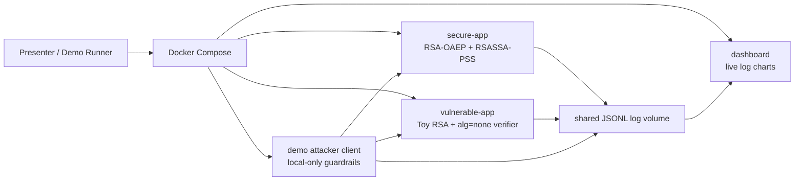

# RSA Demo High Level Design

## Goal

Demonstrate secure RSA encryption and signature flows first, then show controlled local attack scenarios against common RSA misuse patterns. The demo is intentionally split into secure and vulnerable modes so the audience can compare logs and outcomes side by side.

## Scope

- Secure encryption: RSA 2048+ using OAEP with SHA-256.
- Secure signatures: RSASSA-PSS with SHA-256.
- Vulnerable encryption demo: intentionally tiny textbook RSA key, no padding, local-only challenge.
- Vulnerable signature demo: token verifier trusts a client-provided `alg=none` header.
- Availability extension: bounded local load against expensive RSA private-key operations, with rate-limit logs.

## Out Of Scope

- No public-target load testing.
- No distributed traffic generation.
- No exploit code for real services.
- No private-key extraction from production-grade RSA.

## Components

## Secure Normal Flow

1. Client asks secure app for public-key metadata.
2. Client encrypts a message using RSA-OAEP-SHA256.
3. Secure app decrypts with its private key and emits an opaque success/failure log.
4. Client asks secure app to sign a payload with RSASSA-PSS-SHA256.
5. Client verifies the signature through the secure app.
6. Client issues and verifies a signed token where the allowed algorithm is pinned to `PS256`.

## Attack Flow 1: Weak RSA Encryption

The vulnerable app publishes an intentionally small toy RSA public key and a ciphertext. The attacker factors `n`, reconstructs the private exponent, and decrypts the message.

This models the core lesson: RSA security depends on key size, padding, and implementation hygiene. It does not claim that RSA-2048 can be factored in the demo.

## Attack Flow 2: Signature Verification Bypass

The vulnerable app accepts an unsigned token because it trusts the token header's `alg=none`. The secure app rejects the same token because it pins `PS256` and verifies with RSASSA-PSS.

## Availability / DDOS Extension

RSA private-key operations are CPU-expensive compared with normal request handling. The bounded-load demo sends a small local burst of decrypt requests to show:

- CPU-sensitive endpoints need rate limits.
- Logs should distinguish successful crypto operations from rate-limit rejections.
- Expensive crypto should sit behind authentication, quotas, and circuit breakers.

This is a local availability demonstration, not a distributed denial-of-service tool.

## Dashboard Flow

All Java containers print JSON logs to stdout and, when `LOG_FILE` is set, append the same lines to `/logs/events.jsonl`. Docker Compose mounts that path as a shared named volume. The dashboard service tails the file and streams events to the browser with Server-Sent Events.

The dashboard charts:

- `latencyMs` values from secure crypto operations.
- HTTP status counts from demo-client responses.
- `status200` and `status429` aggregates from the bounded-load demo.
- Recent raw JSON logs for explanation during calls.

## Mitigations Demonstrated

- RSA key size is enforced at 2048+ bits in secure mode; default is 3072 bits.
- Encryption uses OAEP with SHA-256, not textbook RSA or PKCS#1 v1.5 encryption.
- Signatures use RSASSA-PSS with SHA-256.
- Token verification pins the expected algorithm and rejects client-selected algorithms.
- Decryption errors are opaque to avoid oracle-style leakage.
- Rate limiting protects private-key operations.
- Logs include request ids, algorithm choices, timing, and rejection reasons.

## Other Scenarios This Can Extend To

- Padding-oracle education: show why distinguishable decrypt errors are dangerous, without implementing a real oracle.
- JWT RS256/HS256 confusion: demonstrate why verifier key type and algorithm must be pinned.
- Replay attacks: add nonce, timestamp, and one-time token stores.
- Key rotation failure: compare `kid` handling with an allowlisted key registry.
- Certificate-chain validation gaps: show trusted CA path validation versus accepting any public key.
- Side-channel hygiene: compare opaque errors and constant decision paths with verbose failures.
- Crypto cost exhaustion: compare unauthenticated signing/decryption endpoints with quota-protected endpoints.
